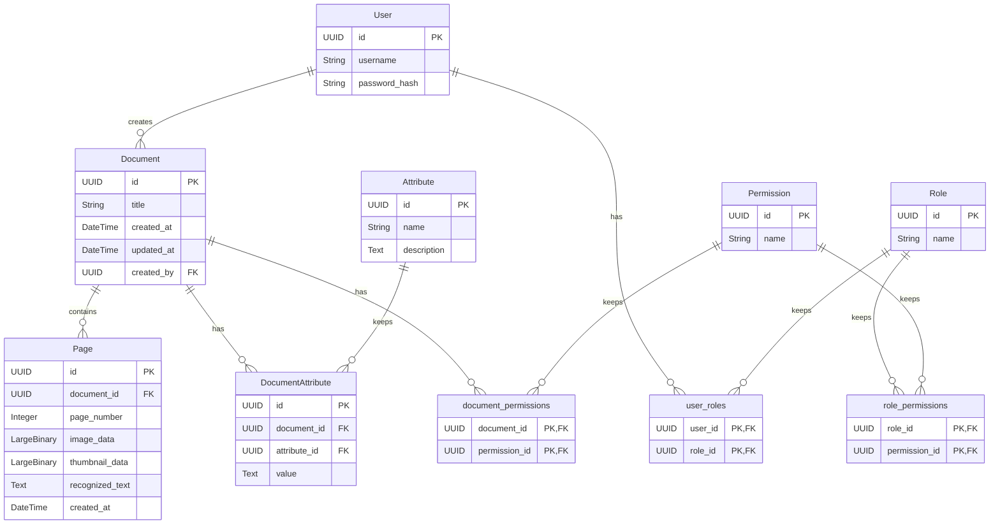

# Database diagram

```mermaid
erDiagram
    User {
        UUID id PK
        String username
        String password_hash
    }
    
    Role {
        UUID id PK
        String name
    }
    
    Permission {
        UUID id PK
        String name
    }
    
    Document {
        UUID id PK
        String title
        DateTime created_at
        DateTime updated_at
        UUID created_by FK
    }
    
    Page {
        UUID id PK
        UUID document_id FK
        Integer page_number
        LargeBinary image_data
        LargeBinary thumbnail_data
        Text recognized_text
        DateTime created_at
    }
    
    Attribute {
        UUID id PK
        String name
        Text description
    }
    
    DocumentAttribute {
        UUID id PK
        UUID document_id FK
        UUID attribute_id FK
        Text value
    }

    user_roles {
        UUID user_id PK, FK
        UUID role_id PK, FK
    }
    
    role_permissions {
        UUID role_id PK, FK
        UUID permission_id PK, FK
    }
    
    document_permissions {
        UUID document_id PK, FK
        UUID permission_id PK, FK
    }

    User ||--o{ Document : "creates"
    User ||--o{ user_roles : "has"
    Role ||--o{ user_roles : "keeps"
    Role ||--o{ role_permissions : "keeps"
    Permission ||--o{ role_permissions : "keeps"
    Document ||--o{ Page : "contains"
    Document ||--o{ DocumentAttribute : "has"
    Document ||--o{ document_permissions : "has"
    Attribute ||--o{ DocumentAttribute : "keeps"
    Permission ||--o{ document_permissions : "keeps"

```